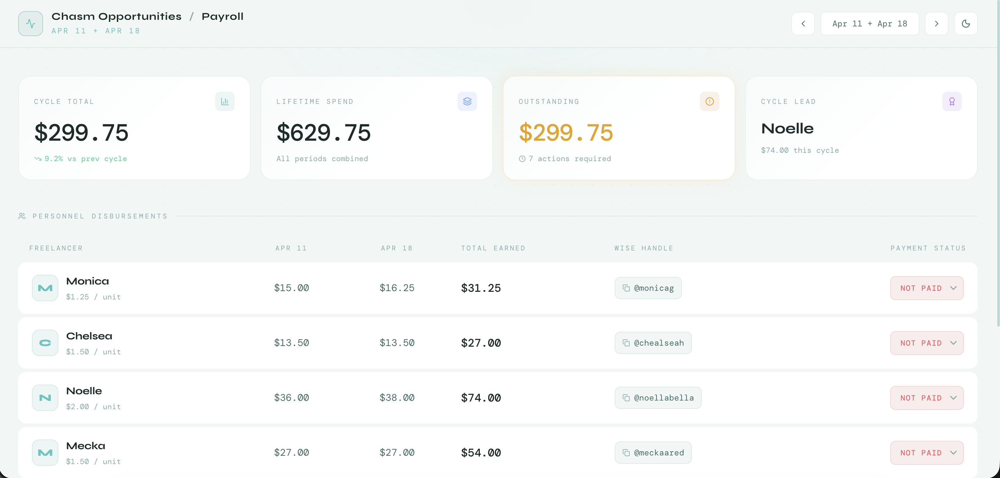
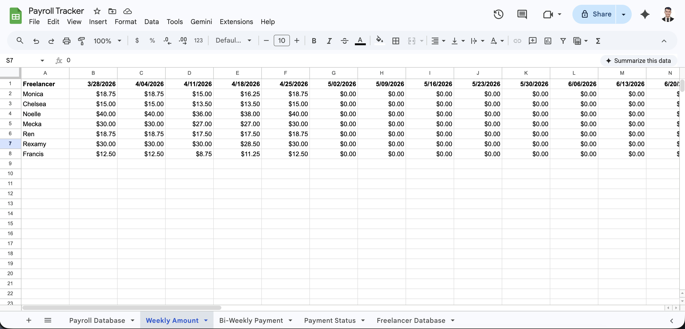
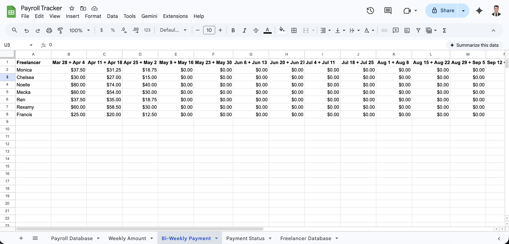
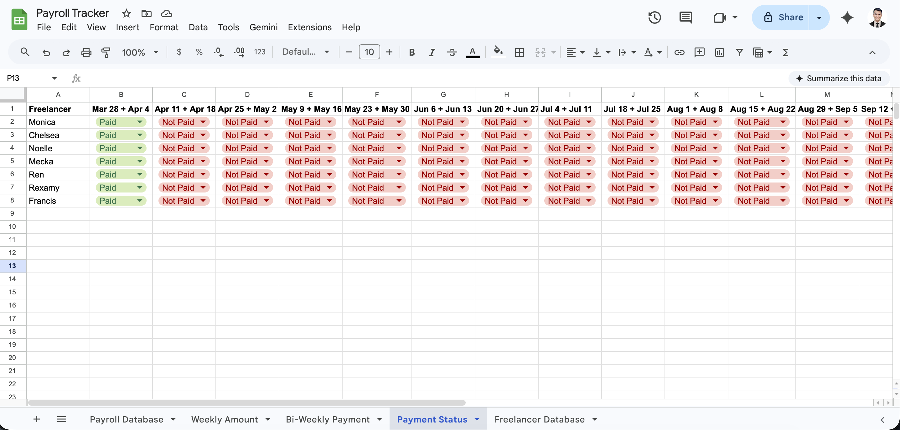

# Payroll Tracker Dashboard
> A Google Sheets-powered payroll cockpit that gives business owners a real-time view of freelancer payments, weekly hours, and bi-weekly pay cycles — without the complexity of payroll software.


---

## Preview

**Dashboard View**


**Weekly Amount Sheet**


**Bi-Weekly Payment Sheet**


**Payment Status Sheet**


---

## The Problem

Managing freelancer payroll manually is a costly mistake waiting to happen. Business owners juggling multiple contractors with different rates, weekly hours, and payment cycles end up buried in spreadsheet tabs — losing track of who's been paid, who hasn't, and what's owed before the next cycle even starts.

---

## The Solution

Payroll Tracker Dashboard consolidates three Google Sheets (Weekly Hours, Bi-Weekly Totals, and Payment Status) into a single, executive-level cockpit. It auto-detects the current pay period, calculates what each team member is owed, and lets you mark payments as done in one click — all without leaving the browser.

---

## Key Features

- **Auto pay-period detection** — automatically lands on the current bi-weekly cycle based on today's date
- **Full payroll schedule** — pre-loaded bi-weekly periods from Mar 2026 through Dec 2027
- **Per-staff rate management** — each team member has a configured hourly rate; totals calculate automatically
- **Three-sheet sync** — Weekly Amount, Bi-Weekly Payment, and Payment Status sheets stay in sync in real time
- **One-click payment status** — mark any team member as Paid / Pending / Not Paid directly from the dashboard
- **Wise tag display** — shows each freelancer's Wise payment handle alongside their balance for frictionless transfers
- **Dark / Light mode** — polished UI built for daily executive use

---

## Tech Stack

| Layer | Technology |
|-------|------------|
| Backend | Google Apps Script |
| Frontend | HTML, Tailwind CSS, Vanilla JavaScript |
| Database | Google Sheets (3 synced tabs) |
| Icons | Lucide Icons |
| Fonts | Google Fonts (Syne, DM Mono) |
| Hosting | Google Apps Script Web App |

---

## How It Works

1. **Load** — the dashboard fetches all three sheets (Weekly Amount, Bi-Weekly Payment, Payment Status) in a single server call on page load
2. **Auto-detect period** — the app compares today's date against the full payroll schedule and lands on the current active cycle
3. **View cycle** — each team member's Week 1 hours, Week 2 hours, bi-weekly total, and calculated pay are displayed in one row
4. **Mark status** — clicking a status badge (Paid / Pending / Not Paid) writes the update directly to the Payment Status sheet via the Apps Script API
5. **Navigate periods** — use Previous / Next to review past or future pay cycles without touching the spreadsheet

---

## My Contribution

Designed and built the full system — from structuring the three-tab Google Sheets data model to building the Apps Script backend that joins and serves all three sheets in one call. Engineered the auto-period detection logic, the full 2026–2027 bi-weekly schedule, and the one-click status sync that writes back to the sheet in real time. Built the executive dashboard UI from scratch with Tailwind CSS and dark/light mode support.

---

## Getting Started

```bash
# 1. Set up your Google Sheet with three tabs:
#    - "Weekly Amount"     (rows: staff names, columns: week dates)
#    - "Bi-Weekly Payment" (rows: staff names, columns: period labels e.g. "Mar 28 + Apr 4")
#    - "Payment Status"    (rows: staff names, columns: period labels)
# 2. Open Apps Script (Extensions → Apps Script) in your sheet
# 3. Paste the contents of Payroll Tracker.gs
# 4. Paste the contents of Payroll Tracker.html as a new HTML file named "Index"
# 5. Update STAFF_DATA with your team's names, Wise handles, and hourly rates
# 6. Deploy → New Deployment → Web App → Execute as Me → Anyone with access
# 7. Share the deployment URL with your team
```

---

## Results & Impact

- Eliminated manual payroll calculation errors by automating weekly-to-biweekly totals across 7 team members
- Reduced pay cycle processing time from ~45 minutes of spreadsheet work to under 5 minutes per cycle
- Gave the business owner a single view to confirm all payments before each Wise transfer, reducing missed or duplicate payments
- Covers a full 2-year payroll schedule with zero recurring setup cost

---

## Status

Production — actively used for bi-weekly payroll. Potential next steps: email payment confirmations, cumulative YTD pay summary, and export to PDF per cycle.
